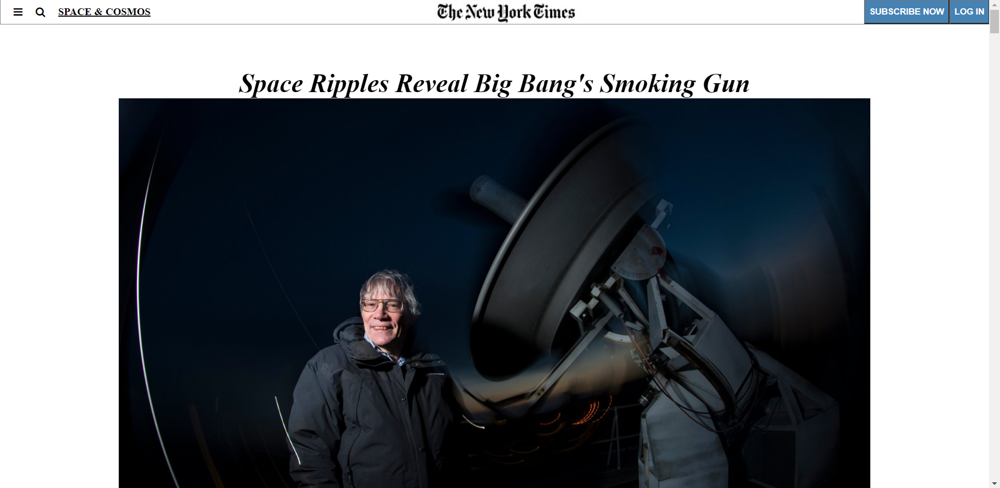

# Positioning-and-Floating-Elements#

This project clones the New York Times Artice webpage "Space Ripples Reveal Big Bang’s Smoking Gun".

**Built With:**

----
- HTML
- CSS

----
**Live Demo:**

----
- Our cloned copy: https://tasheka.github.io/Positioning-and-Floating-Elements-Project/
- The original page: https://www.nytimes.com/2014/03/18/science/space/detection-of-waves-in-space-buttresses-landmark-theory-of-big-bang.html?_r=0

----
**Authors:**

----
1. Tasheka Hamilton
- Github: https://github.com/Tasheka
- Linkedln: https://linkedln.com/Tasheka

2. Paul Clue
- Github: https://github.com/PaulClue
- Linkedln: https://github.com/PaulClue

----
**Contributing:**

----
Contributions and feature requests are welcome!

----
**Issues:**

----
Issue request are welcome!

----
**Feel free to check the link:**

----
https://github.com/Tasheka/Positioning-and-Floating-Elements-Project/issues

----
**Show your support**

----
Give a star if you like this project!

